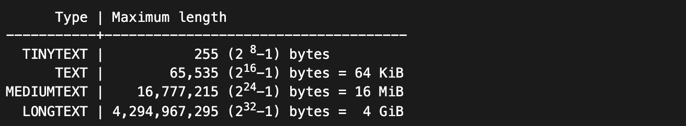
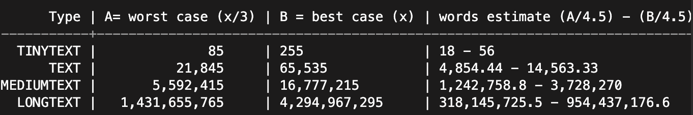

## Tipos de campo para texto

Los tipos de campo que maneja MySQL son los siguientes: TINYTEXT, TEXT, MEDIUMTEXT y LONGTEXT

Estimación del tamaño de cada tipo de campo

Estimaciones máxima y mínima sobre el número de palabras

Medida en base a palabras en inglés.

> Notas
>
> - El número de caracteres depende del tipo de codificación.
> - Las estimaciones de multi-byte se refieren a idiomas como Geek, Arabic, Hebrew, Hindi, Thai, etc

**Referencias:**

- [Pregunta en StackOverflow](https://stackoverflow.com/questions/13932750/tinytext-text-mediumtext-and-longtext-maximum-storage-sizes/35785869#35785869)
- [Instala MySQL en MacOS X](devops/instala-mysql-para-macos.md)
